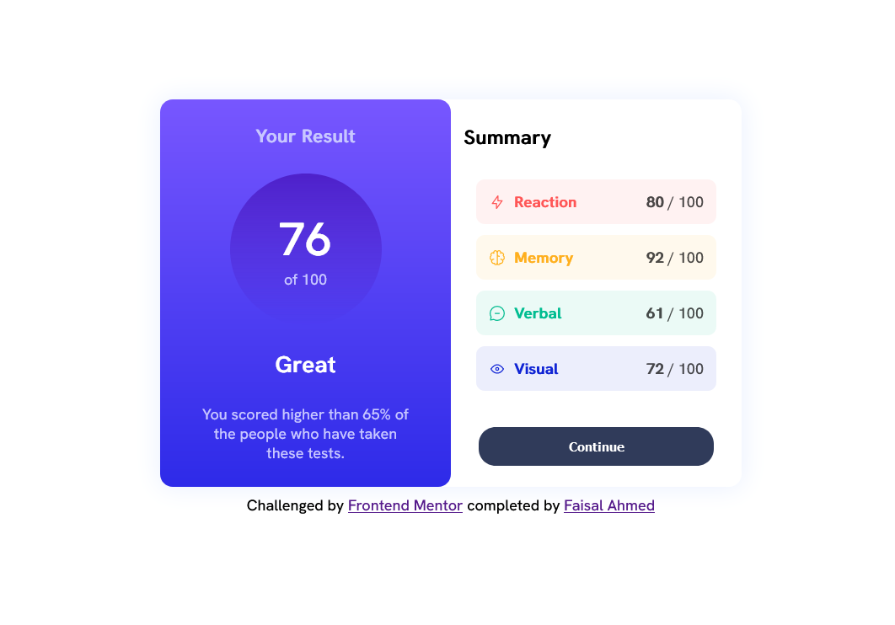
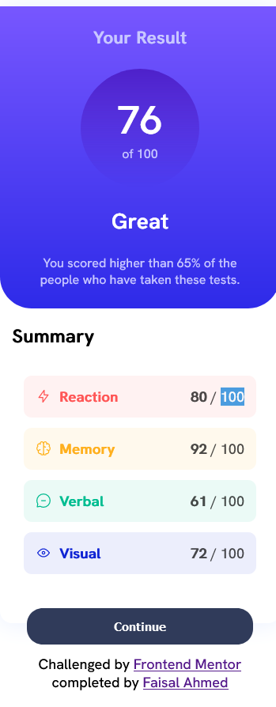

# Frontend Mentor - QR code component solution

This is a solution to the [QR code component challenge on Frontend Mentor](https://www.frontendmentor.io/challenges/qr-code-component-iux_sIO_H). Frontend Mentor challenges help you improve your coding skills by building realistic projects. 

## Table of contents

- [Overview](#overview)
  - [Screenshot](#screenshot)
  - [Links](#links)
- [My process](#my-process)
  - [Built with](#built-with)
  - [What I learned](#what-i-learned)
  - [Continued development](#continued-development)
  - [Useful resources](#useful-resources)
- [Author](#author)
- [Acknowledgments](#acknowledgments)

## Overview
This is a practice based front end project, one can do it with plane HTML, CSS and js or using frameworks.
This project is about building a simple two-sided-card with result and summary sections, result sections contains score out of 100 and a tag with its guideline text, while summary shows scores of each category. images like qr and favicon and icons of the categories are given, more importantly the finial design is also given.

### Screenshot

### Links

- Live Site URL: [https://frontend-qr-challenge.vercel.app/](https://result-summary-challenge.vercel.app/)

## My process
 Using HTML, CSS and JS Learnings, I start implementing UI design from the outer most main components like container and section then putting all the sub-components, then comes the most interesting part you might have guessed it is called CSS Styling.
off course, it backs life in it, colors, images and design was given already so it became easy to full fill it.

### Built with

- Semantic HTML5 markup
- CSS custom properties
- Flexbox
- Gradient
- Mobile-first workflow
- [React](https://reactjs.org/) - JS library
- [Next.js](https://nextjs.org/) - React framework

## Author

- Frontend Mentor - [@faisalahmed11](https://www.frontendmentor.io/profile/@faisalahmed11)
- Twitter - [@FaisalAhmed_01](https://www.twitter.com/FaisalAhmed_01)

## Acknowledgments

I Would like to thank a lot to the Frontend Mentor team for such a amazing work towards improving students skills with such a amazing and interesting practical challenges and also providing all the support with project material, solution and connecting us with our peers.
