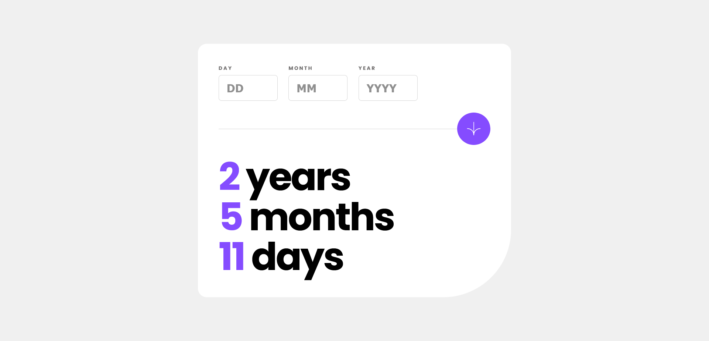
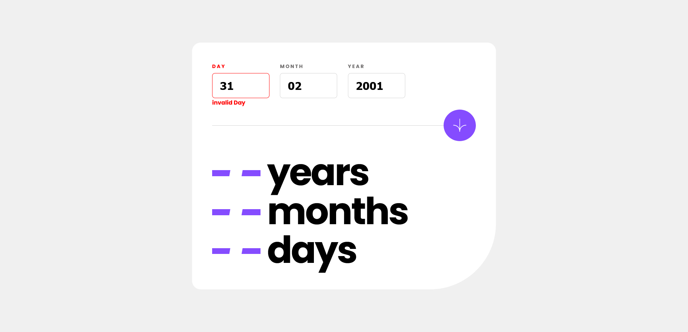
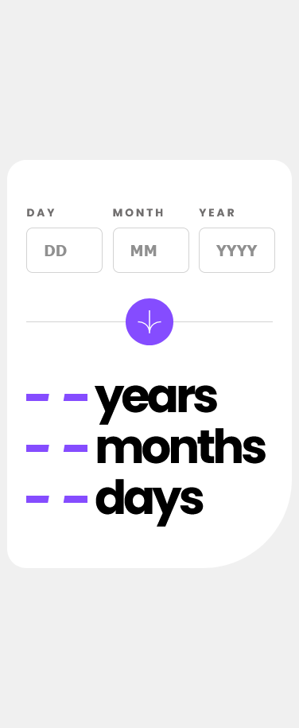
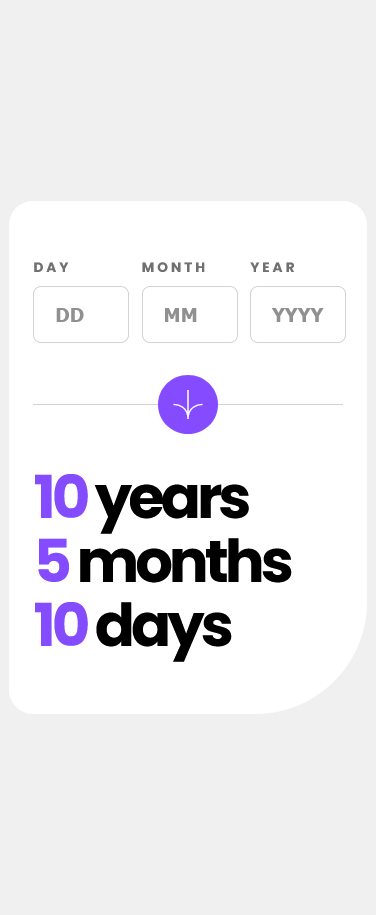

# Frontend Mentor - Age calculator app solution

This is a solution to the [Age calculator app challenge on Frontend Mentor](https://www.frontendmentor.io/challenges/age-calculator-app-dF9DFFpj-Q). Frontend Mentor challenges help you improve your coding skills by building realistic projects. 

## Table of contents

- [Overview](#overview)
- [Screenshot](#screenshot)
- [Links](#links)
- [My process](#my-process)
- [Built with](#built-with)
- [What I learned](#what-i-learned)
- [Continued development](#continued-development)
- [Useful resources](#useful-resources)
- [Author](#author)
- [Acknowledgments](#acknowledgments)

## Overview

This is my solution to Frontend mentor age calculator challenge, this app can calculate all ages from 1000 AD to 2200 AD,

### Screenshot

### Links
- Live Site URL: [https://age-calculator-challenge.vercel.app/](https://age-calculator-challenge.vercel.app/) 

### my-process
With Frontend learnings it became possible to complete this project, using HTML , Sass and JS, starting with layout of the app, then with HTML and JS I handled all the input validation and age calculator function using new Date object; 

### what-i-learned

As you know, practice is the only way of getting hands on best practices, therefore as I practice, I learn how to practice more. How to write more clean and optimized code.

### Built with

- Semantic HTML5 markup
- CSS custom properties
- SASS
- Flex-box
- Grid
- Mobile-first workflow
- [React](https://reactjs.org/) - JS library
- [Next.js](https://nextjs.org/) - React framework

## Author

- Twitter - [@FaisalAhmed_01](https://www.twitter.com/FaisalAhmed_01)

## Acknowledgments

I would like to thank Frontend Mentor Team, for being such an amazing platform and educating millions of students everyday with valuable resources without any cost. 
